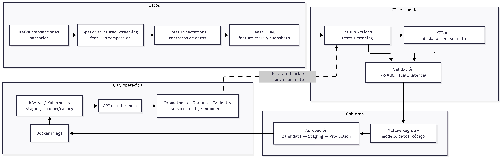

**Máster en Inteligencia Artificial**

*MLOps y AIOps: Despliegue de Modelos en Entornos de Producción*

**Actividad 2**

**Diseño de un pipeline de Machine Learning con integración y despliegue continuo (CI/CD)**

*Caso de uso: Detección de fraude en transacciones bancarias*

**Integrantes del grupo:**

[Javier Madrid González]
[Juan Luis Bodí Torralba]
[Darío Jáuregui Hernández]
[Nombre Apellido1 Apellido2]

Fecha: \[29/06/2026\]

# **1\. Introducción y caso de uso**

El fraude durante las transacciones bancarias representa pérdidas globales superiores a 40.000 millones de dólares anuales, por eso el caso de uso elegido es la detección de fraude en transacciones bancarias en tiempo real. Este problema exige un enfoque MLOps por tres motivos:

* **Extremo desbalanceo de clases**: la proporción de transacciones fraudulentas frente a las legítimas es ínfima, ya que aproximadamente, las transacciones fraudulentas representan el 0,2% de las transacciones totales.
* **Evolución rápida de los patrones de ataque**: las personas que cometen este tipo de delito adaptan continuamente sus tácticas y técnicas para superar los sistemas de detección, provocando que la relación estadística que existe entre las características de una transacción y su naturaleza fraudulenta cambie con el tiempo.
* **Exigencia de latencias muy bajas** para no degradar la experiencia del cliente legítimo.

Estas tres propiedades hacen que un enfoque tradicional, es decir, entrenar un modelo, exportarlo y olvidarlo, sea inviable. El modelo debe reentrenarse con frecuencia, debe poder revertirse en minutos si su comportamiento se degrada y debe servirse con garantías de disponibilidad.
En consecuencia, el problema no es solo de modelado sino de ingeniería: requiere un pipeline reproducible y automatizado bajo principios de CI/CD.

## **1.1. Diagrama general del pipeline**

El flujo separa cuatro bloques. El bloque de datos valida y versiona la información antes de entrenar. El bloque de CI comprueba código, datos y modelo antes de registrar un candidato. El bloque de CD empaqueta y despliega el modelo de forma gradual. El bloque de operación mide tanto la salud técnica del servicio como el comportamiento estadístico del modelo, cerrando el ciclo con alertas, rollback o reentrenamiento validado.

# **2\. Diseño del pipeline**

## **2.1. Preparación y validación de datos**

La fuente principal son las transacciones que el sistema bancario publica, en forma de evento, en un topic de Kafka, con los siguientes campos: autorización, importe, comercio, geolocalización, dispositivo y hora. Seguidamente, un job de Spark Structured Streaming consume el topic y enriquece **cada ******evento con features agregadas, como por ejemplo: importe medio del cliente en 24 h, número de transacciones en una hora, distancia al último punto de uso, etc.

Antes de entrenar un modelo, es obligatorio que los datos sean validados con Great Expectations, en el que se comprueba el esquema, los rangos, elementos nulos y las distribuciones esperadas. Si alguna expectativa falla, el pipeline se detiene y emite una alerta.

Las features validadas se materializan en un feature store o Feast que garantiza consistencia entre entrenamiento y servicio, evitando training-serving skew, y se versionan junto con la snapshot de datos en DVC sobre S3, de modo que cada experimento sea totalmente reproducible.

## **2.2. Entrenamiento y validación de modelos**

El entrenamiento se ejecuta como un workflow de GitHub Actions que se dispara ante tres eventos: push a la rama main del repositorio de modelado, llegada de un nuevo dataset etiquetado o degradación detectada por el monitor de producción.

El modelo utilizado es un XGBoost con manejo explícito del desbalanceo pues es adecuado para datos tabulares, rápido de entrenar y más explicable que arquitecturas profundas para este caso. Para ello, este modelo utiliza los hiperparámetros scale\_pos\_weight, que ajusta el peso de la clase positiva, y subsample, que controla qué fracción de las muestras de entrenamiento se usa para construir cada árbol. Su principal ventaja frente a redes neuronales más complejas es la trazabilidad y un coste de entrenamiento bajo, crítico cuando se reentrenará semanalmente.

En cuanto a las técnicas de validación del modelo, no se reduce únicamente a calcular la métrica accuracy, sino que se priorizan PR-AUC, recall y precisión en el conjunto de alertas, ya que el equipo de investigación humano solo puede revisar un volumen limitado de alertas. Si el modelo es capaz de superar en estas métricas sobre un conjunto de validación al modelo actual en producción, este pasaría a la siguiente fase.

## **2.3. Registro y versionado de modelos**

Cada modelo entrenado se registra en MLflow Model Registry junto con su firma, sus métricas, el hash del dataset (DVC), el commit del código y el entorno. El registro implementa estados Staging, Production y Archived, lo que permite promociones y reversiones explícitas y auditables. Es la pieza que conecta el ciclo CI con el ciclo CD.

## **2.4. Despliegue y monitorización en producción**

Una vez validado y aprobado, el modelo se empaqueta en una imagen Docker y se despliega en Kubernetes mediante KServe, primero en staging y después con estrategia shadow o canary. Esta decisión permite escalar horizontalmente, aislar dependencias y mantener una latencia baja, algo especialmente importante en un caso de detección de fraude en tiempo real. La exposición del modelo como API REST facilita su integración con los sistemas transaccionales del banco.

La monitorización se diseña en dos niveles. En el nivel técnico se controlan latencia, disponibilidad, errores de servicio y consumo de CPU o memoria con Prometheus y Grafana. En el nivel de modelo se supervisan métricas como PR-AUC, recall, desviación de las variables de entrada y data drift con Evidently. Si el rendimiento cae por debajo de un umbral definido, el pipeline genera una alerta y activa la revisión del modelo o el rollback a la última versión estable en Production.

Esta fase completa el ciclo CI/CD porque no se limita a desplegar el modelo, sino que mantiene un bucle de mejora continua: observar, decidir, reentrenar y desplegar de nuevo cuando sea necesario. En un escenario de fraude, esta capacidad es clave para reaccionar a nuevos patrones de ataque sin interrumpir el servicio.

## **2.5. Colaboración y organización del trabajo**

El documento se ha elaborado de forma conjunta para asegurar coherencia técnica en todas las fases del pipeline. Para reflejar esa colaboración, el equipo ha distribuido el trabajo en responsabilidades complementarias: una parte se ha centrado en la preparación y validación de datos, otra en el entrenamiento y la evaluación del modelo, y otra en el registro, despliegue y monitorización.

Además, todas las decisiones se han revisado en común antes de incorporarlas al documento final, usando una única versión del pipeline para evitar inconsistencias entre secciones. Este enfoque mejora la trazabilidad del trabajo, reduce duplicidades y refuerza el criterio de la rúbrica relativo al nivel de colaboración reflejado en el documento.

## **2.6. Beneficios de la propuesta**

La principal ventaja de esta propuesta es que convierte un problema de machine learning en un proceso operativo y reproducible. El uso combinado de Great Expectations, Feast, DVC y MLflow aporta trazabilidad de datos y modelos; GitHub Actions automatiza la validación y Kubernetes junto con KServe permite un despliegue escalable y mantenible.

Desde el punto de vista del negocio, el flujo reduce el tiempo entre la detección de un cambio en los datos y la puesta en producción de un nuevo modelo. Además, mejora la capacidad de respuesta ante los fraudes, limita el impacto de una degradación del rendimiento y facilita la auditoría de cada decisión técnica tomada durante el ciclo de vida del modelo.

# **Referencias**

Chen, T. y Guestrin, C. (2016). XGBoost: A Scalable Tree Boosting System. KDD.

Sculley, D. et al. (2015). Hidden Technical Debt in Machine Learning Systems. NeurIPS.

Huyen, C. (2022). Designing Machine Learning Systems. O’Reilly Media.

Treveil, M. et al. (2020). Introducing MLOps. O’Reilly Media.

Documentación oficial: MLflow, Feast, Great Expectations, Evidently, Kubernetes.
